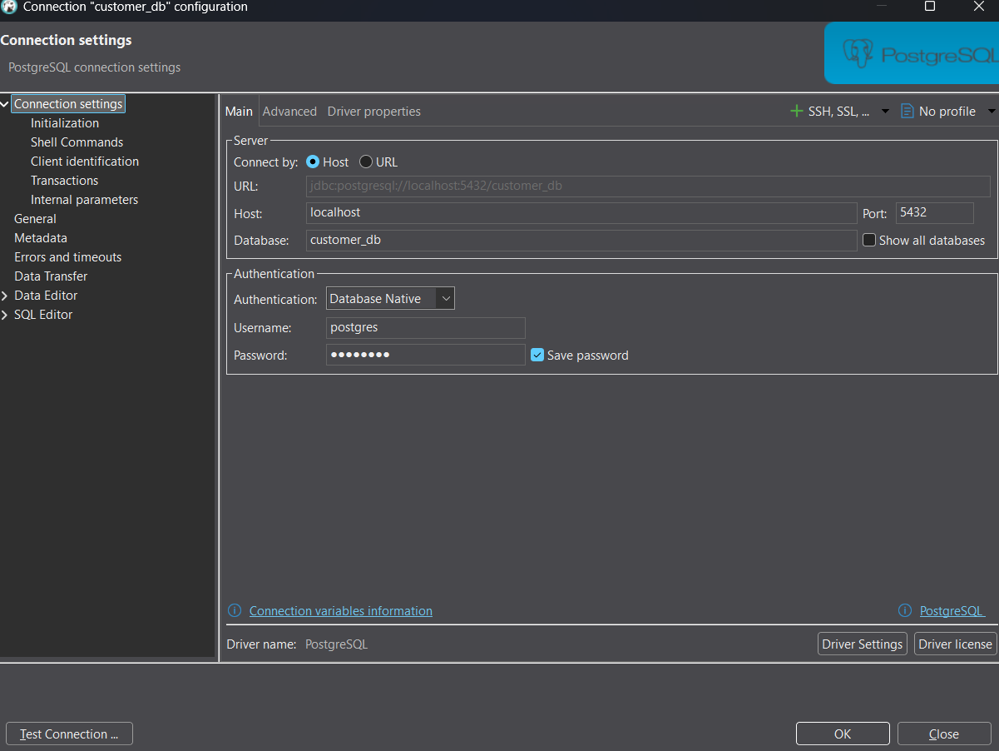
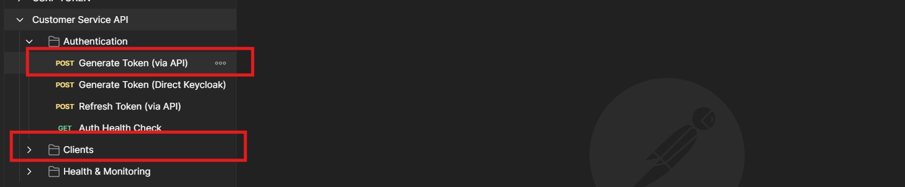

# Guidelines to deploy
## Software needed 
1. Docker or Docker desktop
2. Dbeaver
3. Postman
4. Java 17


## Downloading quarkus libraries with maven 
###### shell script
- `./mvnw clean install`

## Running the application in dev mode
You can run your application in dev mode that enables live coding using:

###### shell script
- `./mvnw quarkus:dev`

### Install needed docker images
###### shell script
- `docker compose up -d`

### Connect to database

``` 
database: customer_db
user: postgres
password: postgres
``` 
### Create database structure
[Create database](config/database/create_database.sql)
### Create table structure
[Create table](config/database/create_table.sql)
###### Insert data to table
[Insert data to table client](config/database/import_table.sql)

### Import Postman collection
[Import postman collection](config/postman/Customer Service API.postman_collection.json)
1. Consume service to generate token
2. Now you can consume client endpoints to get data
